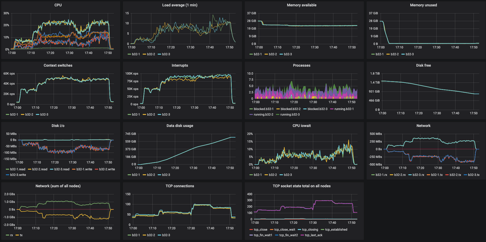
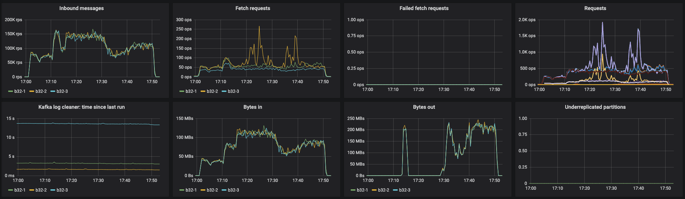
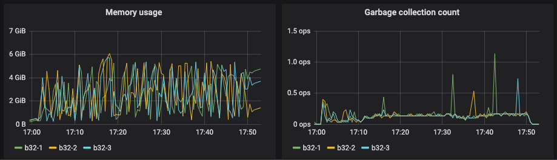

# Runtime

Because of outbound traffic volume it is recommended to run these pods on smaller nodes,
i.e. many pods fit onto a single node and each node wants to publish or consume AS MUCH
DATA AS POSSIBLE!

The compute portion will be run in the cloud, co-located in the same cloud region as
your Kafka cluster. You computer might be fast, but probably don't have a 10GB fiber
network connection.

# Setup

Remember to set these on BOTH the `avn-k-producer` and the `avn-k-reader` deployments.

| Environment Variable | Description              |
| -------------------- | ------------------------ |
| `AIVEN_TOKEN`        | Your API token.          |
| `AIVEN_PROJECT`      | Your Aiven project name. |
| `AIVEN_SERVICE`      | Your Aiven service name. |

# Deployment

```sh
$ kubectl apply -f deploy.yaml
...
$ kubectl scale --replicas=10 deployment.apps/avn-k-producer
...
$ kubectl scale --replicas=20 deployment.apps/avn-k-reader
...
$ kubectl delete -f deploy.yaml
```

# Evaluating Results

If you use Terraform to setup the project, it will create InfluxDB and
Grafana services, and sets custom dashboards for the kafka service. Use
these dashboards if possible.

Here are some example screenshots:

### Server Metrics



### Kafka Metrics



### JVM + Garbage Collection Metrics


